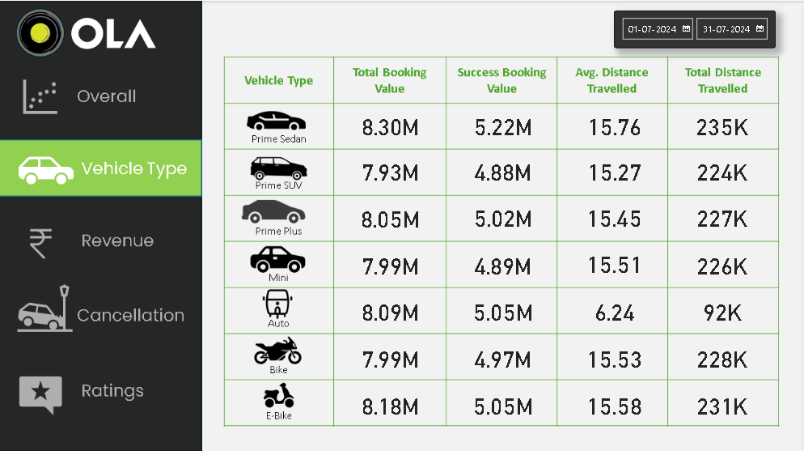
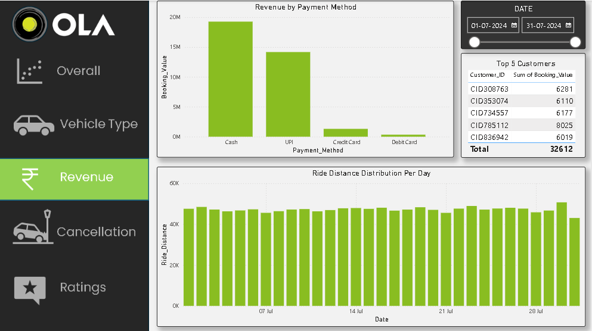
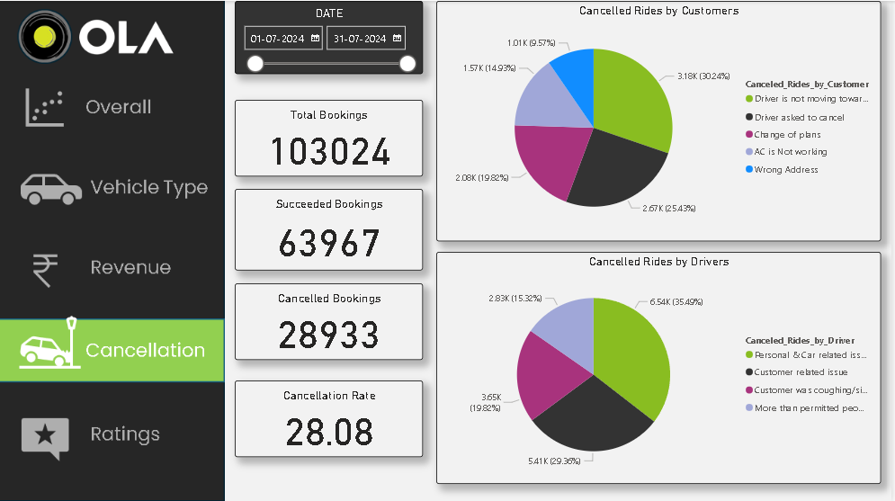
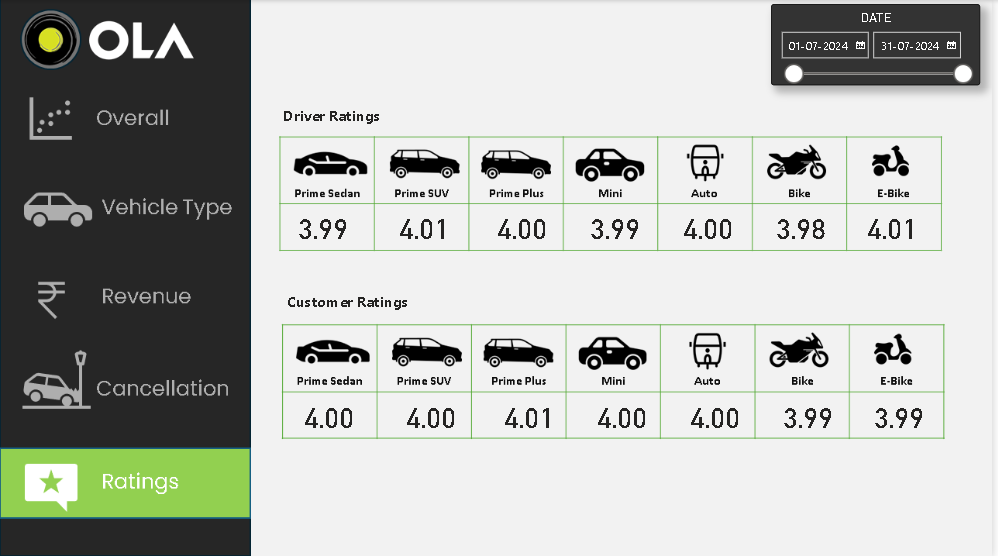

# 🚖 OLA Ride-Booking Data Analysis & Visualization

[](#)
[](#)
[](#)

A comprehensive data analysis and visualization project based on OLA ride-booking data. This project explores booking patterns, cancellation trends, revenue analytics, and customer/driver ratings using SQL (database queries and views), Power BI (interactive dashboards), and Microsoft Excel (initial data processing).

---

## 🎯 Project Objectives

To analyze ride-booking data from OLA, identify trends, and create interactive, visual dashboards that provide actionable business insights into:
- 📈 **Booking Trends & Volume:** Performance over time, booking success rates, and demand patterns.
- 🚗 **Vehicle Segment Insights:** Booking counts, average distance, and ratings per vehicle type.
- 💰 **Revenue Analysis:** Top spenders, total booking values, and distribution of payment methods.
- ❌ **Cancellation Analysis:** Segregated reasons for ride cancellations by customers and drivers.
- ⭐ **Rating Distribution:** Comparative analysis of customer vs. driver ratings.

---

## 🛠️ Tech Stack

- **SQL (MSSQL / MySQL):** Querying, data filtering, and view creation for structured reporting.
- **Power BI:** Data modeling, DAX calculations, and interactive visual dashboard development.
- **Microsoft Excel:** Large dataset inspection, initial exploratory analysis, and data cleanup.

---

## 📊 Repository Structure

The project is structured with the following files and folders:

- 📑 **[OLA-Data-Analyst-Project.pdf](OLA-Data-Analyst-Project.pdf):** The project blueprint containing detailed SQL queries, Power BI visual requirements, and key insights.
- 📊 **[Bookings-100000-Rows.xlsx](Bookings-100000-Rows.xlsx):** The dataset containing over 100,000 bookings with full attributes (ID, status, location, value, ratings, reasons, etc.).
- 💾 **[Ola_Data_Analysis.sql](Ola_Data_Analysis.sql):** SQL script with 10 structured queries and view creation for key analytical questions.
- 📈 **[Ola_Data_Visualization.pbix](Ola_Data_Visualization.pbix):** The Power BI workbook containing all interactive dashboard pages.
- 🎨 **[Ola-Slides/](Ola-Slides/):** Folder containing the custom canvas background images used for the Power BI dashboard layout.

---

## 🔍 SQL Analysis & Core Questions

The SQL script contains optimized queries and database views that answer these ten critical business questions:
1. **Successful Bookings:** Retrieve and inspect all rides that completed successfully.
2. **Vehicle Type Efficiency:** Calculate the average ride distance for each vehicle type.
3. **Customer Cancellations:** Count the total number of rides cancelled by customers.
4. **Top Customers:** Identify the top 5 customers by total booking frequency.
5. **Driver Issues:** Count driver cancellations due to personal or vehicle issues.
6. **Ratings Analysis (Prime Sedan):** Find the minimum and maximum driver ratings for Prime Sedans.
7. **UPI Transactions:** Filter and retrieve all rides paid using UPI.
8. **Vehicle Ratings:** Calculate the average customer rating for each vehicle type.
9. **Revenue Summary:** Calculate the sum of all booking values for successful rides.
10. **Incomplete Rides:** List all incomplete rides along with their cancellation reasons.

---

## 🖥️ Interactive Dashboard Preview

Below are the dashboard pages developed in Power BI:

### 1. Overall Trends


### 2. Vehicle Insights


### 3. Revenue Analysis


### 4. Cancellations Analysis


### 5. Ratings Analysis


---

## 🚀 How to Replicate

1. **Clone the Repository:**
   ```bash
   git clone https://github.com/priyansh0712/Ola_dashbord.git
   ```
2. **Database Setup:**
   - Load the `Bookings-100000-Rows.xlsx` dataset into your SQL database (e.g. MySQL, MSSQL Server).
   - Execute the SQL script `Ola_Data_Analysis.sql` to generate views and verify insights.
3. **Power BI Dashboard:**
   - Open `Ola_Data_Visualization.pbix` in **Power BI Desktop**.
   - If needed, update the data source path to point to your local copy of `Bookings-100000-Rows.xlsx`.
   - Interact with the visual elements, filters, and drill-throughs.

---

## 🔮 Future Enhancements

- [ ] Integrate Python/R scripts for predictive modeling (e.g., ride demand forecasting).
- [ ] Implement automated ETL pipelines for real-time dashboard data refreshes.
- [ ] Add advanced tooltips and detail drill-through pages to the Power BI dashboard.

---

## 🤝 Connect

Created by **[Priyansh Vekariya](https://github.com/priyansh0712)**. Feel free to reach out for questions, collaboration, or suggestions!
